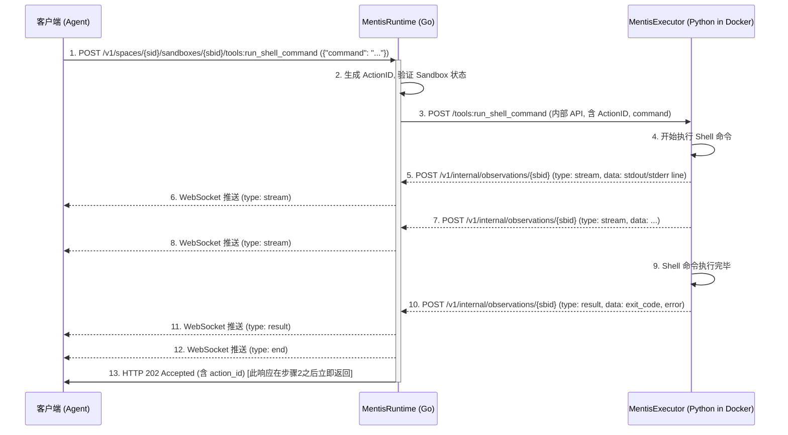

# MentisSandbox

MentisSandbox 是一个安全、持久化、具备实时反馈能力的沙箱环境，旨在为 AI Agent（特别是基于 LangGraph 或 CrewAI 构建的 Agent）提供可靠的执行后端。它使用 Docker 容器提供安全隔离，同时通过 WebSocket 实现实时通信，让 AI Agent 能够获取命令执行的即时反馈。

## 功能特点

### 安全性
- 通过 Docker 容器提供强隔离环境
- 限制资源使用 (未来计划)
- 以非 root 用户运行内部进程

### 持久性
- 每个沙箱会话拥有持久化的文件系统 (`/work` 作为默认工作目录)
- 支持长期运行的 Agent 会话，IPython 内核状态在同一沙箱的**顺序**调用中保持

### 实时交互
- **Shell 命令执行**：安全、**并发**地执行 Shell 命令并获取实时反馈。
- **IPython 代码执行**：在持久化的 IPython 环境中**顺序**执行代码（同一沙箱内的并发请求将排队），保持会话状态。
- **WebSocket 实时通信**：获取命令执行过程中的流式输出和状态更新。

### 多租户与组织 (Spaces)
- **Spaces**: 提供逻辑隔离层，允许将沙箱分组管理。每个沙箱都属于一个 Space。

### 可扩展性
- 基础 Docker 镜像可自定义和配置
- 支持自托管部署
- 模块化设计便于未来功能扩展

## 安装与配置

### 前置要求

- Go 1.22+ 
- Docker 
- Make (可选，用于构建脚本) 
- WebSocket 客户端 (例如 `websocat`，用于测试) 
- curl (用于 API 请求) 
- Python 3.8+ (用于使用 Python 客户端) 

### 构建与启动

1.  **克隆代码库** 

    ```bash
    git clone [https://github.com/yourusername/sandboxai.git](https://github.com/yourusername/sandboxai.git) # 请替换为实际仓库地址
    cd sandboxai
    ```

2.  **构建 Docker 镜像** (包含 MentisExecutor) 

    ```bash
    make build-box-image
    ```

3.  **启动 MentisRuntime 服务** 

    有两种方式启动服务器：

    a. 编译后运行：
    ```bash
    make build/sandboxaid
    ./bin/sandboxaid
    ```

    b. 直接运行 Go 代码：
    ```bash
    go run ./go/mentisruntime/main.go
    ```

    服务默认监听在 `127.0.0.1:5266`。

4. **安装 Python 客户端** 

    ```bash
    # 假设你的包已经可以安装
    pip install -e .
    # 或者 pip install mentis-client (如果已发布)
    ```

## 快速开始

### 使用 Python 客户端

MentisSandbox 提供了 Python 客户端库 (`mentis_client`)，支持两种使用模式：

#### 1. 连接模式

连接到已运行的 MentisRuntime 服务器：

```python
from mentis_client.client import MentisSandbox
import queue
import time # 引入 time

# 创建观察队列
obs_queue = queue.Queue()

# 连接到服务器并创建沙箱
# 使用 try...finally 确保沙箱被删除
sandbox = None
try:
    # 确保 Runtime 服务正在运行
    sandbox = MentisSandbox.create(
        base_url="http://localhost:5266", # 确保 URL 正确
        observation_queue=obs_queue,
        space_id="default" # 使用 default space
    )
    print(f"沙箱已创建: {sandbox.sandbox_id}")
    # 等待 WebSocket 连接稳定 (如果需要)
    time.sleep(1)

    # --- 执行 Python 代码 ---
    code_to_run = "var = 'World'; print(f'Hello, {var}!')"
    print(f"\n执行 IPython: {code_to_run}")
    action_id_py = sandbox.run_ipython_cell(code_to_run)
    print(f"IPython Action ID: {action_id_py}")

    # --- 健壮地等待并收集结果 (直到 'end') ---
    print("等待 IPython 结果...")
    ipython_observations = []
    ipython_stdout = ""
    start_time = time.time()
    while time.time() - start_time < 30.0: # 增加超时
        try:
            obs = obs_queue.get(timeout=1.0) # 使用带超时的 get
            if getattr(obs, 'action_id', None) == action_id_py:
                print(f"  收到观测: {getattr(obs, 'observation_type', 'Unknown')}")
                ipython_observations.append(obs)
                if getattr(obs, 'observation_type', None) == "stream" and getattr(obs, 'stream', None) == "stdout":
                    ipython_stdout += getattr(obs, 'line', '')
                if getattr(obs, 'observation_type', None) == "end":
                    print("  收到 'end' 信号")
                    break # 收到 end 后退出循环
        except queue.Empty:
            print("  队列暂时为空...")
            continue # 继续等待

    print("\nIPython 执行完成。")
    print(f"收到的观测数量: {len(ipython_observations)}")
    print(f"STDOUT:\n{ipython_stdout.strip()}")
    # 可以在这里添加对 exit_code 的检查

    # --- 执行 Shell 命令 ---
    command_to_run = "echo 'Hello from Shell' && ls /work"
    print(f"\n执行 Shell: {command_to_run}")
    action_id_sh = sandbox.run_shell_command(command_to_run)
    print(f"Shell Action ID: {action_id_sh}")

    # --- 健壮地等待并收集结果 (直到 'end') ---
    print("等待 Shell 结果...")
    shell_observations = []
    shell_stdout = ""
    start_time = time.time()
    while time.time() - start_time < 30.0: # 增加超时
        try:
            obs = obs_queue.get(timeout=1.0)
            if getattr(obs, 'action_id', None) == action_id_sh:
                print(f"  收到观测: {getattr(obs, 'observation_type', 'Unknown')}")
                shell_observations.append(obs)
                if getattr(obs, 'observation_type', None) == "stream" and getattr(obs, 'stream', None) == "stdout":
                    # Shell 输出是按行来的，我们拼接起来
                    shell_stdout += getattr(obs, 'line', '') + '\n'
                if getattr(obs, 'observation_type', None) == "end":
                    print("  收到 'end' 信号")
                    break
        except queue.Empty:
            print("  队列暂时为空...")
            continue

    print("\nShell 执行完成。")
    print(f"收到的观测数量: {len(shell_observations)}")
    print(f"STDOUT:\n{shell_stdout.strip()}")
    # 可以在这里添加对 exit_code 的检查

except Exception as e:
    print(f"发生错误: {e}")
finally:
    if sandbox:
        print(f"\n删除沙箱: {sandbox.sandbox_id}")
        sandbox.delete() # delete() 方法会处理连接关闭

```

#### 2. 嵌入式模式

自动管理 Runtime 服务器进程，无需手动启动（**注意:** 不能与已运行的独立 Runtime 同时使用默认端口）：

```python
from mentis_client.embedded import EmbeddedMentisSandbox
import queue
import time

# 创建观察队列
obs_queue = queue.Queue()

# 使用嵌入式模式 (确保没有其他服务监听默认端口，或指定不同端口)
try:
    with EmbeddedMentisSandbox(
        observation_queue=obs_queue,
        space_id="default" # 假设使用默认 space
        # port=5267 # 可以指定不同端口避免冲突
    ) as sandbox:
        print(f"嵌入式沙箱已创建并连接: {sandbox.sandbox_id}")
        # 执行 Python 代码
        action_id = sandbox.run_ipython_cell("print('Hello from Embedded Mode!')")
        print(f"IPython Action ID: {action_id}")

        # 等待并收集结果 (使用健壮逻辑)
        print("等待结果...")
        stdout = ""
        start_time = time.time()
        while time.time() - start_time < 30.0:
            try:
                obs = obs_queue.get(timeout=1.0)
                if getattr(obs, 'action_id', None) == action_id:
                    print(f"  收到观测: {getattr(obs, 'observation_type', 'Unknown')}")
                    if getattr(obs, 'observation_type', None) == "stream" and getattr(obs, 'stream', None) == "stdout":
                        stdout += getattr(obs, 'line', '')
                    if getattr(obs, 'observation_type', None) == "end":
                        print("  收到 'end' 信号")
                        break
            except queue.Empty:
                continue

        print("\n执行完成。")
        print(f"STDOUT:\n{stdout.strip()}")

except Exception as e:
    print(f"嵌入式模式出错: {e}")

# 嵌入式服务器会在程序退出时自动停止 (通过 atexit)
```

#### 3. LangGraph / CrewAI 集成

MentisSandbox 提供了实验性的 LangGraph 和 CrewAI 工具集成。请参阅 `experimental/README.md` 获取详细用法。

### 使用 HTTP API (原始方式)

MentisRuntime 启动时会自动创建一个名为 `default` 的 Space。

#### 1. 创建沙箱 (在 default Space 中)

```bash
curl -X POST http://127.0.0.1:5266/v1/spaces/default/sandboxes \
  -H "Content-Type: application/json" \
  -d '{}' # 可以留空，使用默认镜像
```

这将返回新创建沙箱的完整状态，包括其 ID：

```json
{
  "sandbox_id": "YOUR_SANDBOX_ID", 
  "ContainerID": "...",
  "AgentURL": "http://...", 
  "IsRunning": true, 
  "SpaceID": "default" 
}
```
**记下返回的 `sandbox_id` (YOUR_SANDBOX_ID)。**

#### 2. 连接到 WebSocket 流

在一个单独的终端中，使用 `websocat` (或其他 WebSocket 客户端) 连接到沙箱的 WebSocket 流，以接收实时输出：

```bash
websocat ws://127.0.0.1:5266/v1/sandboxes/YOUR_SANDBOX_ID/stream
```
将 `YOUR_SANDBOX_ID` 替换为上一步获取到的 ID。

#### 3. 执行 Shell 命令

```bash
curl -X POST http://127.0.0.1:5266/v1/spaces/default/sandboxes/YOUR_SANDBOX_ID/tools:run_shell_command \
  -H "Content-Type: application/json" \
  -d '{"command": "echo \"Hello from MentisSandbox Shell\" && sleep 2 && echo \"Shell Done.\""}'
```
你将在 `websocat` 连接的终端看到 "Hello from MentisSandbox Shell" 和 "Shell Done." 的输出。

#### 4. 执行 Python 代码 (IPython)

```bash
curl -X POST http://127.0.0.1:5266/v1/spaces/default/sandboxes/YOUR_SANDBOX_ID/tools:run_ipython_cell \
  -H "Content-Type: application/json" \
  -d '{"code": "import time\nprint(\"Hello from IPython\")\ntime.sleep(2)\nprint(\"IPython Done.\")"}'
```
你将在 `websocat` 连接的终端看到 "Hello from IPython" 和 "IPython Done." 的输出。

#### 5. 清理沙箱 (可选)

```bash
curl -X DELETE http://127.0.0.1:5266/v1/spaces/default/sandboxes/YOUR_SANDBOX_ID
```

## 测试

MentisSandbox 提供了一个全面的测试脚本 `test/test_sandbox.sh`，它包含多个测试用例，涵盖从基础功能到高级特性的各个方面。

### 运行测试

1.  **确保 MentisRuntime 服务正在运行。**
2.  **执行测试脚本**

    ```bash
    # 确保脚本有执行权限
    chmod +x test/test_sandbox.sh 
    # 运行测试
    ./test/test_sandbox.sh
    ```

更详细的测试指南，请查看 [docs/TESTING.md](TESTING.md)。

## 系统架构

MentisSandbox 由两个主要组件构成：

1.  **MentisRuntime** (Go)：(职责描述保持不变) [cite: 1]
    * 管理 Docker 容器 (Sandboxes) 的生命周期。
    * 管理 Spaces，提供逻辑分组。
    * 提供 REST API 接口用于管理 Spaces 和 Sandboxes，以及执行命令。
    * 管理 WebSocket 连接和消息广播，实现实时反馈。
    * 处理命令执行请求并将其分发给对应的 MentisExecutor。

2.  **MentisExecutor** (Python)：(更新描述) [cite: 1]
    * 运行在每个 Docker 容器 (Sandbox) 内。
    * 监听来自 MentisRuntime 的命令执行请求 (通过内部 HTTP API)。
    * 执行 Shell 命令（可并发）。
    * **通过加锁机制顺序执行** 同一个沙箱内的 IPython 代码请求，保证状态一致性。
    * 将执行过程中的输出 (stdout/stderr) 和最终结果（包括结构化错误信息）实时推送回 MentisRuntime (通过内部 HTTP API)。

### 数据流架构

```mermaid
graph LR
    subgraph Client
        A[外部客户端 / AI Agent]
    end

    subgraph MentisRuntime (Go)
        B(REST API Handler)
        C(WebSocket Hub)
        D(Sandbox Manager)
        E(Space Manager)
        F(Docker Client)
        G(Internal API Handler)
        B -- Manages --> E
        B -- Manages --> D
        D -- Uses --> F
        C -- Gets Updates --> D
        D -- Sends Commands --> H
        G -- Receives Observations --> D
    end
    
    subgraph Docker Container (Sandbox)
        H(MentisExecutor / Agent)
    end

    A -- 1. REST API (Manage/Execute) --> B
    A -- 2. WebSocket (Subscribe) --> C
    D -- 3. Docker API (Create/Start/Stop) --> F -- Controls --> H
    B -- 4. Internal HTTP (Execute Cmd) --> H
    H -- 5. Internal HTTP (Push Observations) --> G
    C -- 6. WebSocket (Push Stream/Result) --> A
```

### 实时通信流程 (以 Shell 命令为例)


## 并发处理设计

MentisSandbox 在处理并发请求时采用以下策略，以兼顾性能和状态一致性：

* **Shell 命令 (`run_shell_command`)**: 完全支持并发执行。来自不同客户端或同一客户端的多个 Shell 命令请求（即使是针对同一个 Sandbox）可以并行处理和执行，因为 Shell 命令通常是无状态的。
* **IPython 代码 (`run_ipython_cell`)**:
    * **不同 Sandbox 之间**: 来自不同客户端或同一客户端针对**不同** Sandbox 实例的 IPython 请求可以完全并发执行。
    * **同一个 Sandbox 之内**: 为了保证 IPython 内核的状态持久性和一致性（例如，在一个单元格中定义的变量可以在下一个单元格中使用），对**同一个** Sandbox 实例的多个 `run_ipython_cell` 请求会**强制按顺序执行**。Executor 内部使用了锁机制，确保一次只有一个 IPython 单元格在给定的 Sandbox 内核中运行。后续请求会自动排队等待。
* **健壮性:** 这种设计显著提高了在并发场景下使用 IPython 的**健壮性**，有效避免了先前可能出现的输出内容混淆、状态污染和内核错误。

这种设计旨在平衡用户对持久化、有状态环境的需求与系统处理并发请求的效率和稳定性。

## API 参考

所有 API 端点均以 `/v1` 为前缀。

### 健康检查

| 端点        | 方法 | 描述           | 成功响应 (200 OK) |
| ----------- | ---- | -------------- | ----------------- |
| `/health`   | GET  | 检查服务健康状态 | `{"status":"ok"}` |

### Space 管理

| 端点             | 方法   | 描述                 | 请求体 (示例)                                                                 | 成功响应 (201/200/204)                                                                                                |
| ---------------- | ------ | -------------------- | ----------------------------------------------------------------------------- | --------------------------------------------------------------------------------------------------------------------- |
| `/spaces`        | POST   | 创建新的 Space       | `{"name": "my-project", "description": "...", "metadata": {"key": "value"}}` | `201 Created` - `{"space_id": "...", "name": "...", ...}`                                                            |
| `/spaces`        | GET    | 列出所有 Spaces      | N/A                                                                           | `200 OK` - `[{"ID": "default", ...}, {"ID": "my-project", ...}]`                                                      |
| `/spaces/{sid}`  | GET    | 获取指定 Space 信息  | N/A                                                                           | `200 OK` - `{"ID": "...", "Name": "...", "Sandboxes": {"sbid1": {...}, ...}}` (包含其下的 Sandbox 状态) |
| `/spaces/{sid}`  | PUT    | 更新 Space 信息      | `{"description": "new desc", "metadata": {"new": "data"}}`                    | `200 OK` - 更新后的 Space 状态                                                                                        |
| `/spaces/{sid}`  | DELETE | 删除指定 Space       | N/A                                                                           | `204 No Content`                                                                                                      |

### Sandbox 管理

| 端点                         | 方法   | 描述                     | 请求体 (示例)                               | 成功响应 (201/200/204)         |
| ---------------------------- | ------ | ------------------------ | ------------------------------------------- | ------------------------------ |
| `/spaces/{sid}/sandboxes`    | POST   | 在指定 Space 创建新 Sandbox | `{"image": "custom-image:tag"}` (可选) | `201 Created` - Sandbox 状态 |
| `/spaces/{sid}/sandboxes/{sbid}` | GET    | 获取指定 Sandbox 状态    | N/A                                         | `200 OK` - Sandbox 状态      |
| `/spaces/{sid}/sandboxes/{sbid}` | DELETE | 删除指定 Sandbox         | N/A                                         | `204 No Content`               |

*   `{sid}`: Space ID (例如 `default`)
*   `{sbid}`: Sandbox ID

### 命令执行 (异步)

这些端点会立即返回 `202 Accepted` 和一个 `action_id`，实际执行结果通过 WebSocket 推送。

| 端点                                       | 方法 | 描述                     | 请求体 (示例)                               | 成功响应 (202 Accepted)        |
| ------------------------------------------ | ---- | ------------------------ | ------------------------------------------- | ------------------------------ |
| `/spaces/{sid}/sandboxes/{sbid}/tools:run_shell_command` | POST | 执行 Shell 命令          | `{"command": "ls -l /work"}`                | `{"action_id": "..."}`         |
| `/spaces/{sid}/sandboxes/{sbid}/tools:run_ipython_cell`  | POST | 执行 IPython 代码        | `{"code": "print(1+1)"}`                    | `{"action_id": "..."}`         |

### WebSocket

| 端点                         | 描述                                       |
| ---------------------------- | ------------------------------------------ |
| `/sandboxes/{sbid}/stream`   | 建立 WebSocket 连接，接收指定 Sandbox 的实时输出流 |

*注意：WebSocket 端点路径当前不包含 `spaceID`。*

### WebSocket 消息格式 (Observation)

所有通过 WebSocket 发送的消息都遵循以下基本结构，具体内容在 `data` 字段中：

```json
{
  "observation_type": "start" | "stream" | "result" | "error" | "end",
  "action_id": "...", // 关联的动作 ID
  // ... 其他字段根据 observation_type 不同而变化
  "timestamp": "..." // ISO 8601 格式时间戳
}
```

| `observation_type` | `data` 字段内容 (示例)                                                                 | 描述                                     |
| ------------------ | -------------------------------------------------------------------------------------- | ---------------------------------------- |
| `start`            | `{}` (可能包含 action 类型等元数据)                                                      | 动作开始                                 |
| `stream`           | `{"stream": "stdout" | "stderr", "line": "输出内容"}`                                   | 标准输出或标准错误流中的一行文本         |
| `result`           | `{"exit_code": 0, "error": null}` (Shell) 或 `{"output": "...", "error": null}` (IPython) | 命令或代码执行的最终结果                 |
| `error`            | `{"message": "错误信息", "details": "..."}`                                            | 执行过程中发生的错误 (例如 Agent 内部错误) |
| `end`              | `{"exit_code": 0, "error": null}` (可能包含最终状态)                                     | 动作结束 (无论成功或失败)                |

## 未来计划

- 添加用户授权和认证
- 支持文件上传/下载到 `/work` 目录
- 提供更多运行时环境选项 (例如 Node.js)
- 增强资源监控和限制功能
- 提供官方 Python 和 JavaScript/TypeScript 客户端库

请参阅 [TODOLIST](docs/TODOLIST.md) 文档。

## 贡献指南

请参阅 [贡献指南](docs/contributing.md) 文档。

## 许可证

[MIT 许可证](LICENSE)
